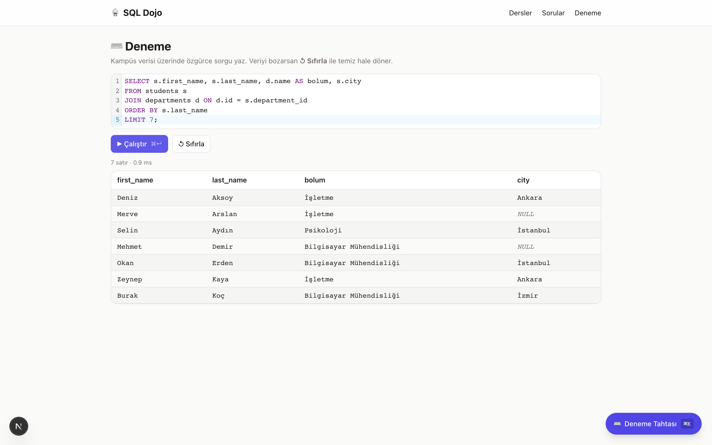
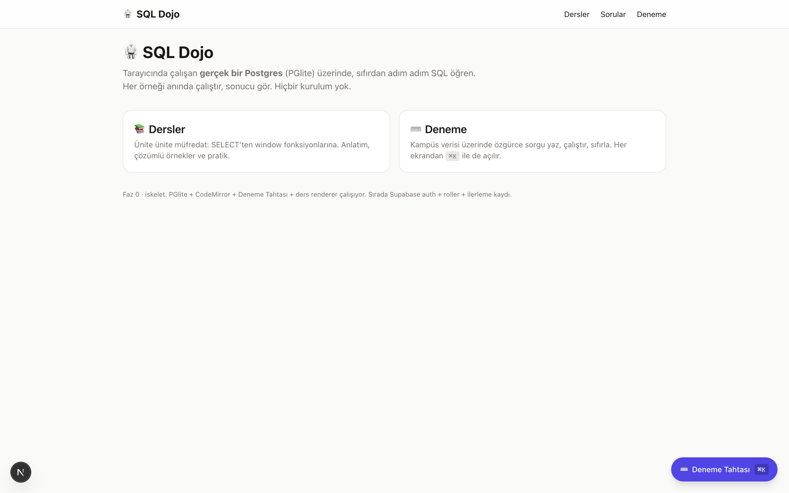
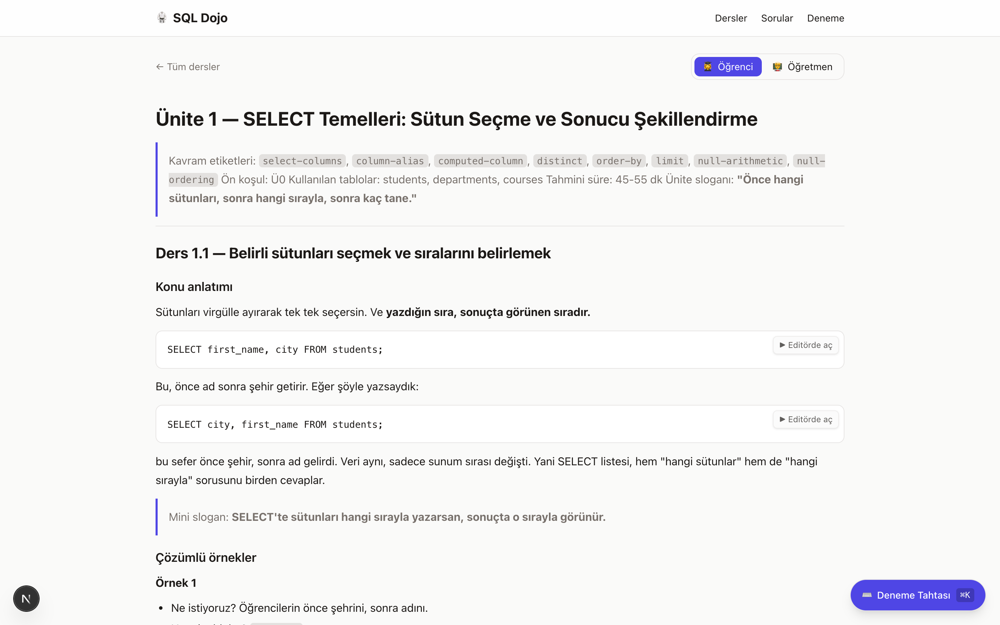
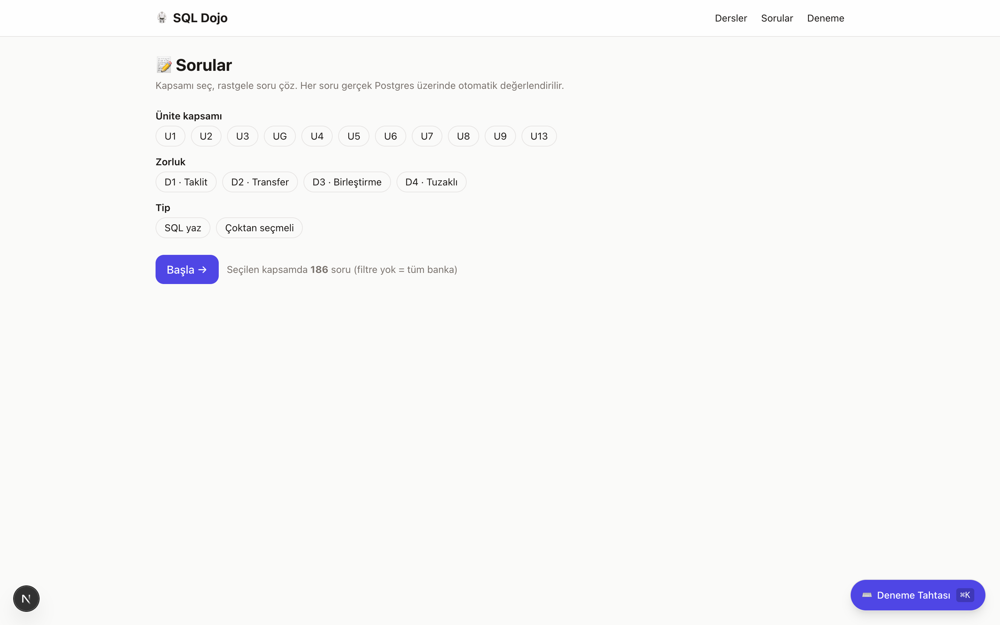
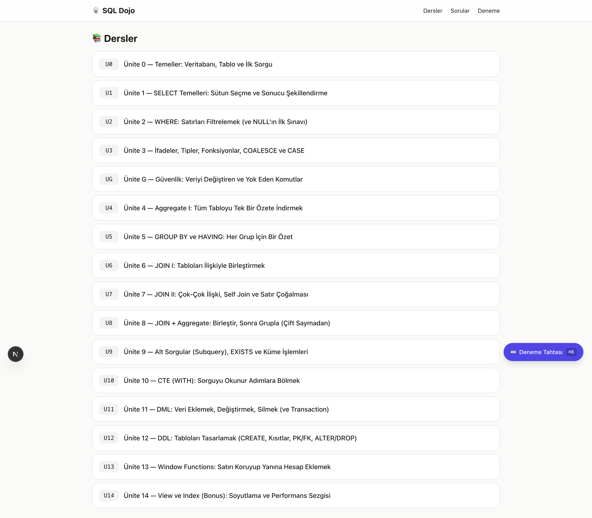

<div align="center">

# 🥋 SQL Dojo

**Tarayıcıda çalışan gerçek bir Postgres (PGlite) üzerinde, sıfırdan adım adım SQL öğreten web uygulaması.**

_An interactive SQL learning app running a real Postgres (PGlite) entirely in your browser. No setup, no server: write a query, run it, see the result instantly._

`Next.js 16` · `React 19` · `TypeScript` · `Tailwind v4` · `PGlite` · `CodeMirror 6` · `Zustand` · `Zod`



</div>

---

## Ne yapar

- 🐘 **Gerçek Postgres, tarayıcıda.** Sorgular [PGlite](https://github.com/electric-sql/pglite) (WASM Postgres) üzerinde çalışır. Kurulum yok, backend yok, anında sonuç.
- 📚 **Ünite ünite müfredat.** SELECT temellerinden window fonksiyonlarına 16 ders: anlatım + çözümlü örnek + pratik.
- 📝 **Otomatik değerlendirilen soru bankası.** Yüzlerce soru, gerçek Postgres üzerinde sonuç karşılaştırmasıyla otomatik puanlanır (SQL yaz + çoktan seçmeli). Ünite ve zorluk (taklit, transfer, birleştirme, tuzaklı) filtreleri.
- ⌨️ **Deneme Tahtası.** Her ekrandan `⌘K` ile açılan global SQL paneli: kampüs verisi üzerinde özgürce dene, `↺ Sıfırla` ile temize dön.
- 🧑‍🏫 **Rol görünürlüğü.** Ders içinde 🧑‍🏫 ile işaretli bölümler sadece öğretmene görünür; öğrenci görünümünde otomatik gizlenir.

## Ekran görüntüleri

<table>
  <tr>
    <td width="50%"><br><sub><b>Ana sayfa</b>: Dersler ve Deneme</sub></td>
    <td width="50%"><br><sub><b>Ders</b>: kavram etiketleri, anlatım, çözümlü örnekler, gömülü editör</sub></td>
  </tr>
  <tr>
    <td width="50%"><br><sub><b>Sorular</b>: ünite + zorluk + tip filtreleriyle otomatik değerlendirilen banka</sub></td>
    <td width="50%"><br><sub><b>Müfredat</b>: ünite ünite ders listesi</sub></td>
  </tr>
</table>

## Çalıştırma

```bash
npm install
npm run dev        # http://localhost:5176  (predev otomatik içerik senkronu yapar)
```

| Komut | Ne yapar |
|---|---|
| `npm run build` | Production build (TypeScript kontrolü dahil) |
| `npm run type-check` | Sadece `tsc --noEmit` |
| `npm run sync:content` | `content/` -> `public/content/` kopyalar + ders `index.json` üretir |
| `npm run db:smoke` | Node'da seed'i PGlite'a yükleyip örnek sorguları doğrular |

## Stack

Next.js 16 (App Router) · React 19 · TypeScript · Tailwind v4 · Zustand 5 · Zod 4 · PGlite (`@electric-sql/pglite`) · CodeMirror 6 (`@uiw/react-codemirror` + `@codemirror/lang-sql`) · react-markdown + remark-gfm + rehype-raw.

## Mimari notlar

- **İki veritabanı:** Pratik sorgular tarayıcıdaki PGlite örneğinde çalışır (`src/lib/db/pglite.ts`); uygulama verisi (hesap/ilerleme) ileride Supabase'e gider. İkisi ayrıdır.
- **Tek çekirdek:** `src/components/sql/SqlRunner.tsx` (editör + Çalıştır + sonuç tablosu) playground, ders örnekleri ve Deneme Tahtası'nda aynen kullanılır.
- **Deneme Tahtası:** her ekrandan `⌘K` / floating buton ile açılan global SQL paneli (`src/features/scratchpad/`). Seed seçimi, `↺ Sıfırla`, tablolar yan paneli, sunum modu.
- **Rol-görünürlük:** ders markdown'ında başlığı 🧑‍🏫 ile başlayan bölümler öğretmene özeldir; öğrenci görünümünde `src/lib/content/strip-teacher.ts` ile çıkarılır.

## İçerik

Kaynak doğruluk `content/` altındadır (16 ders `content/lessons/*.md`, seed `content/seed/campus_seed.sql`). `public/content/` üretilmiş kopyadır (gitignore'da). Tam tasarım: `docs/PLAN.md`, `docs/CURRICULUM_MASTER.md`.

## Durum

**Faz 0 (iskelet) tamam:** scaffold, PGlite + seed (tarayıcıda doğrulandı), CodeMirror editör, Deneme Tahtası, ders renderer + rol-strip, otomatik değerlendirilen Sorular modülü. Sırada: Supabase auth + roller + RLS + ilerleme/deneme tabloları, sonra Faz 1 (Ünite 1 uçtan uca + /progress). Yol haritası: `docs/PLAN.md`.
